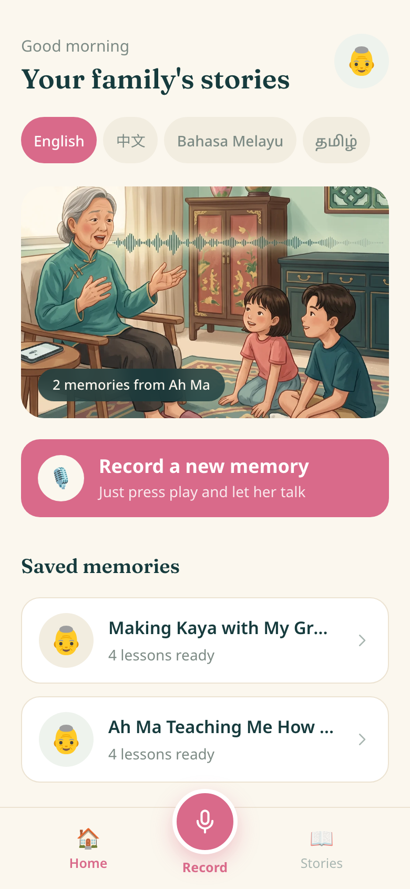
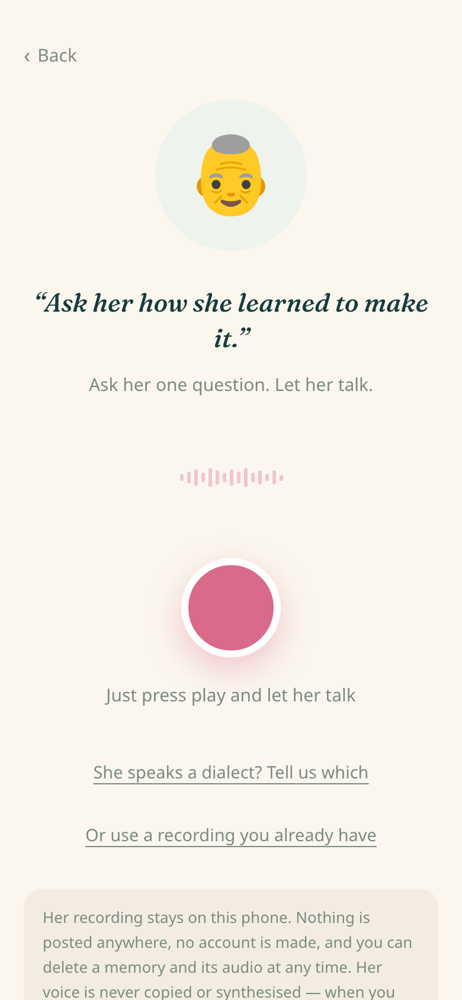
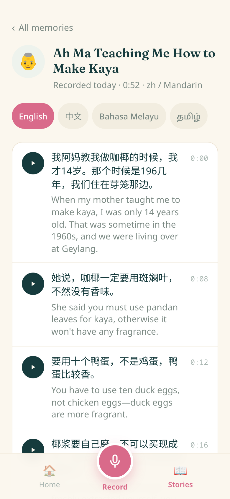
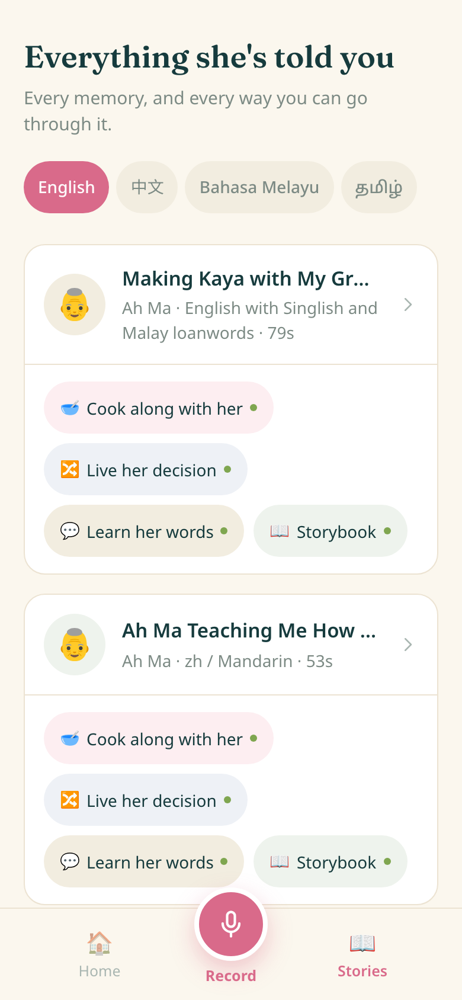
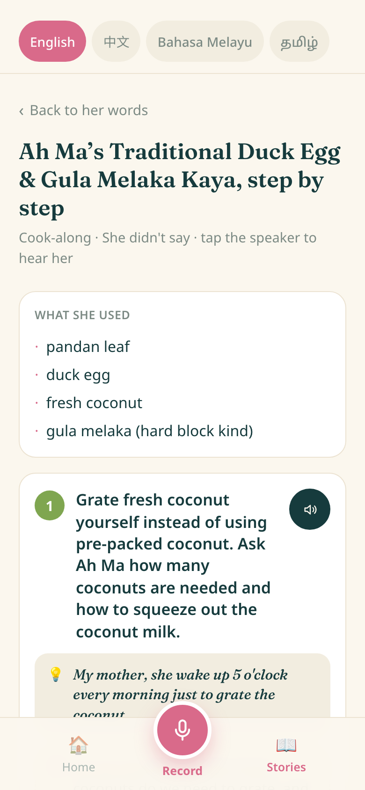
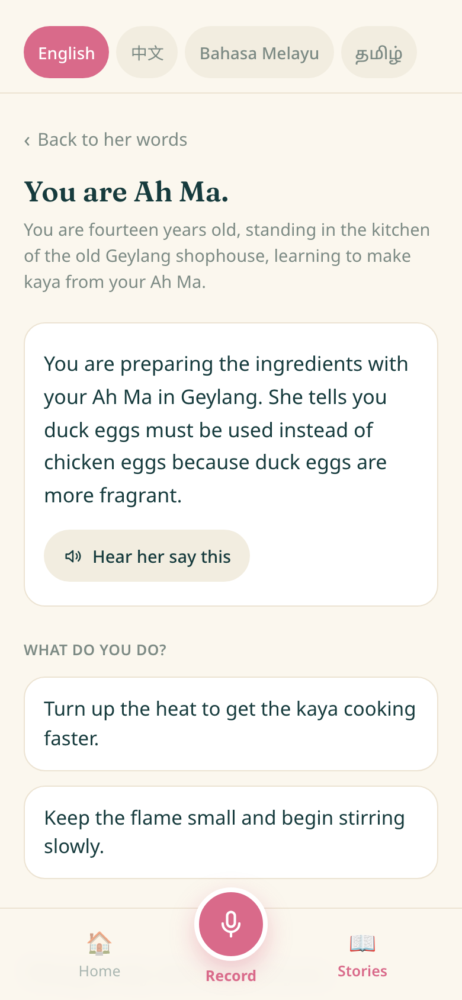
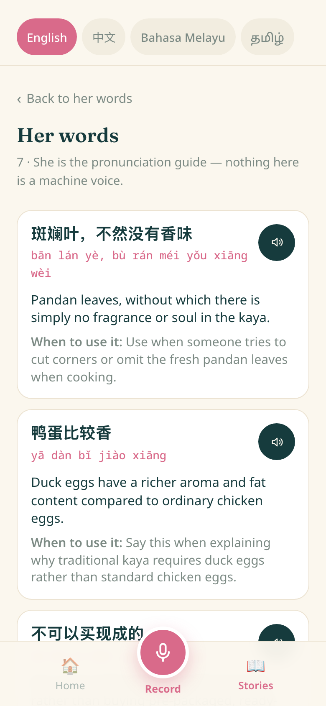
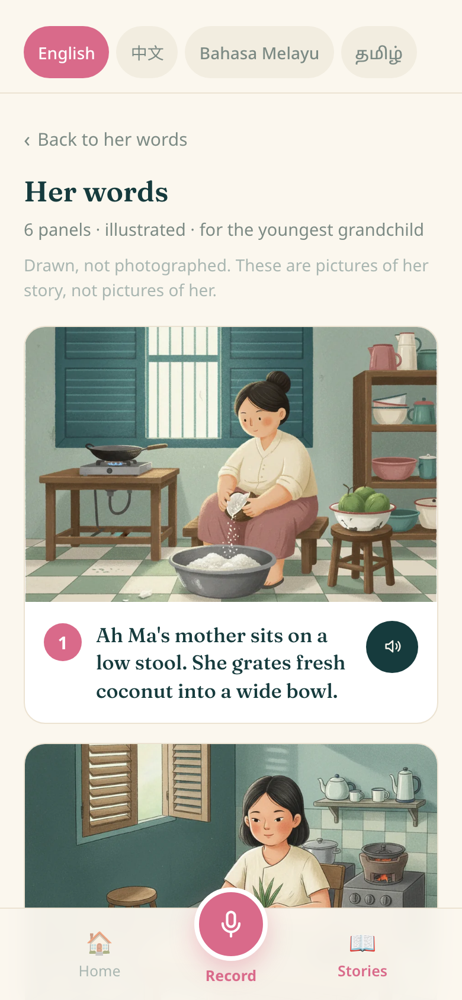

# Heirloom

**Heirloom turns a grandparent's spoken story into an interactive lesson their
grandchild actually wants to do — in any language, in her real voice.**

Ah Ma talks for two minutes in Teochew. Heirloom returns a cook-along, a branching
story, or a dialect phrase coach — in English, Mandarin, Malay or Tamil — with her
original audio still attached under every line. Tap any sentence and hear her say it.

<table>
<tr>
<td width="25%"></td>
<td width="25%"></td>
<td width="25%"></td>
<td width="25%"></td>
</tr>
<tr>
<td align="center"><sub><b>Home</b></sub></td>
<td align="center"><sub><b>Record</b></sub></td>
<td align="center"><sub><b>Her words</b></sub></td>
<td align="center"><sub><b>Stories</b></sub></td>
</tr>
</table>

Every screenshot here is the running app at 390px. Real screens, not mockups.

## Why Gemini is essential, not decorative

Her audio goes to Gemini directly. There is no transcription service in between —
which is the only reason this works in a dialect at all. Strip that out and there is
no product, just a voice recorder.

## Running it

```bash
npm install
cp .env.example .env.local     # then fill in ONE of the two auth paths
npm run dev
```

Auth, either way:

- **Vertex AI + ADC** — set `GOOGLE_CLOUD_PROJECT`, then
  `gcloud auth application-default login`. Nothing secret lands in the repo.
- **Gemini API key** — set `GEMINI_API_KEY` from https://aistudio.google.com/apikey.

Vertex wins if both are set. Check it works:

```bash
curl localhost:3000/api/hello        # -> {"ok":true,"auth":"vertex-adc",...}
npm run understand -- public/your-recording.aiff
```

`npm run understand` runs the audio through the UNDERSTAND pass, prints the full
`Memory` with all four translations, runs the Phase 1 gate checks, and writes
`public/spot-check.html` — open that and tap a line to hear the exact slice it
claims those words are in.

## What we found out about audio timestamps

The spine — tap a line, hear her — depends on knowing when each sentence was said.
**Gemini does not measure that. It guesses, and it guesses badly.**

Measured against a 52.7s recording with known sentence boundaries:

| | worst boundary error |
|---|---|
| `gemini-3.1-pro-preview`, raw | **9.9s** — cumulative drift, every line playing the previous one |
| `gemini-3.7-flash`, raw | starts at 0, 5, 10, 15, 20… and a final `endSec` of 70s on a 52.7s file |
| with Vertex's `audioTimestamp: true` | no better — still an arithmetic sequence |
| **after `lib/align.ts`** | **1.0s** |

So we keep what the model is good at — where the sentence breaks are, and what is
said in each — and throw its numbers away. [`lib/align.ts`](./lib/align.ts) rebuilds
the timeline from the audio itself: predict each segment's length from its text,
scaled to the real file duration, then snap each boundary to the nearest real pause.

`public/synthetic-test.wav` is a machine-generated recording used only to measure
this, because its true boundaries are known to the millisecond. It is a test fixture,
never demo content — the demo uses a real person.

## Languages: she picks one, they pick one

She is never asked to be multilingual — she just talks, in whatever she speaks, and
can name a dialect on the record screen if she wants the transcript sharper. That is
a hint to the model, not a restriction: she can code-switch mid-sentence and usually
does.

The grandchild picks their own language, and **only that one is produced.** The audio
pass returns her words plus one translation. If somebody later switches to another
language, `/api/translate` fills that one in — text-only, Flash tier, once per
language per memory, then stored. Switching back and forth after that spends nothing.

Translating into four languages up front was most of the output tokens on the audio
call, and three quarters of it was never read.

## One recording, several lessons

`/api/generate` writes a lesson against a fixed schema — cook-along, branching story,
or phrase coach — in whichever language the grandchild is reading. Two rules do the
real work:

**Every element carries a `segmentIndex`.** That is how her voice gets inside the
lesson: tap a step and hear her say the sentence it came from. An index that is
missing or out of range means silence when someone taps, which looks worse than a
missing feature — so it is a hard validation failure, retried with the reason, and
backstopped by a fallback lesson built straight from her segments where every index
is correct by construction. Verified: the fallback renders for all three formats
when the model is unreachable.

**Nothing is invented.** Where the memory lacks the detail a step needs, the step
becomes a question. Given a deliberately vague recording that mentions soaking beans
but never says for how long, it produced:

> *"Soak the beans before cooking, but ask Ah Ma how long to soak them and what kind
> of beans she used."*

and no quantity, time or temperature anywhere in the lesson. That gap is the feature:
the app's job is not to replace the conversation, it is to start one.

<table>
<tr>
<td width="33%"></td>
<td width="33%"></td>
<td width="33%"></td>
</tr>
<tr>
<td align="center"><sub><b>Cook-along</b></sub></td>
<td align="center"><sub><b>Branching story</b></sub></td>
<td align="center"><sub><b>Phrase coach</b></sub></td>
</tr>
</table>

The speaker on every card is the `segmentIndex` doing its job — tap it and the
sentence that step came from plays in her voice. The first cook-along step above
is a gap prompt: she never said how many coconuts, so it asks instead of guessing.

## The picture book

The fourth format turns the memory into six illustrated pages for a grandchild too
young to read a transcript. Her real voice sits under every page.

Two things decide whether it works:

**One style, or it looks broken.** Six independent image calls produce six unrelated
pictures. Every panel prompt gets the same fixed style string — medium, palette,
setting, light — and the whole book is pinned to the model that drew its first page.
That is not belt-and-braces: mixing two image models mid-book produced a 1960s
Singapore kitchen on one page and a European one at a different aspect ratio on the
next. Aspect ratio is forced square for the same reason.

**Illustrated, never photographic.** We draw the memory; we do not manufacture a
photograph of a real woman that her family might one day mistake for real. The app
says so on the page: *"Drawn, not photographed. These are pictures of her story, not
pictures of her."* That is an ethical line before it is an aesthetic one.

The drawings do not depend on the reading language — the caption changes, the scene
does not — so a panel is drawn once per memory and reused across all four. The demo
memory's six pages ship in `/public/storybook/`, which is why the book opens in a
tenth of a second and works with the network off.

<p align="center">

</p>

## Safety

- **No invented memories.** Where a lesson needs a detail she didn't give, it renders
  as a question to go and ask her, not a plausible number.
- **Uncertainty is visible.** Dialect words the model isn't sure of are marked, shown
  with a dotted underline, and tappable to hear the original.
- **Her voice is never synthesised.** Translation is a subtitle layer. No cloning —
  a synthetic grandparent voice is not something a family can consent to on behalf of
  someone who may not be around to object.
- Heirloom makes **no inference about cognitive state, mood, or health** from her
  speech, and the prompt forbids it explicitly.

## It works with the network off

The demo memory, her audio, and all twelve of its lessons — three formats in four
languages — ship inside the bundle. A service worker precaches the shell and the
audio, so with the network disabled the app still reloads, renders the transcript,
plays her voice, switches all four languages and opens every lesson. Nothing in the
demo path calls the model at runtime.

The demo recording is machine-generated, not a real grandmother. It proves the
pipeline end to end; it proves nothing yet about dialect, about the uncertainty
flag, or about how a real person's translations read.

That is not polish. Venue wifi dies, and a demo that needs the network is a demo you
might not get to give.

```bash
npm run build && npx next start -p 3100
npm run gate:freeze      # loads it, pulls the plug, and checks all of the above
```

It installs to a home screen as a PWA — standalone, its own icon, lacquer splash.

## Checking it

Each phase has a gate that runs the app rather than reading it. They are the reason
several real bugs got caught: an ending rendered as a dead button, a player that
would have thrown on a shorter translation, a validator whose queue drained itself.

```bash
npm run gate:spine       # capture, transcript, tap-a-line, refresh survival
npm run gate:generate    # segmentIndex in range, gap prompts, fallback payloads
npm run gate:players     # plays every format start to finish at 390px
npm run gate:design      # tokens, gold-leaf spent once, safety UI, no jargon
npm run gate:storybook   # six panels, one style, swipe, her voice per page
npm run gate:freeze      # the offline test, against a production build
```

`gate:generate` and `gate:players` call the model; the rest are free.

## The design

Rice ground, lacquer type, kueh-rose for anything you act on. The palette comes from
Peranakan tilework and lacquered kitchen cabinets, and it is deliberately not the
cream-and-terracotta every other AI demo arrives in. `design.md` is the spec.

Three rules do most of the work:

**One screen with nothing on it.** Record keeps the same rice ground as everywhere
else — it should not feel like a different app — but the tab bar is hidden and there
is exactly one thing to press. That is the screen *she* holds; everything else is
for the grandchild.

**Gold-leaf is never an accent.** It appears in three places and nowhere else: a gap
prompt, an uncertain-word marker, and the moment her memory is kept. A colour used
everywhere stops meaning anything, so the design gate fails if gold shows up on Home,
Record or the transcript.

**A tip and a gap prompt must not look alike.** The tip is her own aside on sand,
in italic. The gap prompt is cream with a dashed gold border and a question mark,
because it is a different kind of thing — a hole we refused to fill, not a note. The
gate compares their computed styles rather than trusting that they look different.

## Icons

Emoji are shipped as SVG files from Google's Noto Emoji (Apache-2.0, see
`public/emoji/LICENSE.txt`), never as text characters. A device without a colour
emoji font renders every emoji as a blank box — an iOS simulator did exactly that to
this app's entire icon set — and that is not a font you control on a judge's phone.

Two sets, used for different jobs. `Emoji.tsx` is identity and decoration: the
grandmother on an avatar, the bowl on a cook-along card, the bulb on her aside.
`Icon.tsx` is monochrome line work for controls that change colour with their state —
play, pause, chevrons, and the white microphone on the rose record button, because a
full-colour glyph cannot invert on a coloured ground.

## Stack

Next.js App Router · TypeScript · Tailwind · `@google/genai` from route handlers only.
Mobile-first at 390px — the setting is a grandchild holding a phone next to their
grandmother at a kitchen table.
